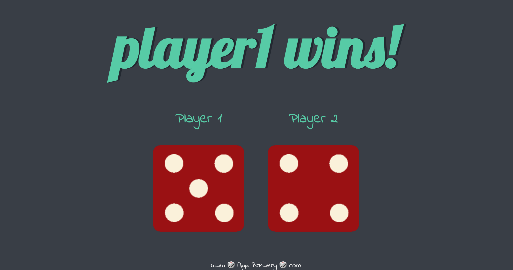

# Dice game

A simgle program for practicing Javascript DOM

# How to use it?

Every time player fresh the page, there will be 2 random dices be generated.

Title will show the winning player who has a larger number dice. What else if the dice number equal? the title will shows"draw!"
